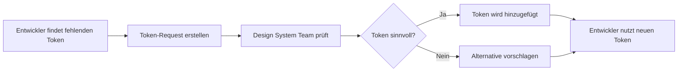

# Design Token Governance

## ⚠️ WICHTIG: Tokens sind NICHT für jeden editierbar!

### Problem
Wenn jeder Entwickler neue Tokens hinzufügt, entsteht Chaos:
- Inkonsistente Namensgebung
- Doppelte Tokens für gleiche Werte
- Verlust der Design-System-Integrität
- Unkontrolliertes Wachstum der Token-Datei

### Lösung: Token Governance Process

## 1. Token-Verwaltung

### Wer darf Tokens ändern?
- **Design System Team**: Vollzugriff
- **UX/UI Designer**: Vorschlagsrecht
- **Entwickler**: NUR Verwendung bestehender Tokens

### Token-Request-Prozess


## 2. Praktische Umsetzung

### A) Token Request Template
```markdown
## Token Request

**Requested by**: [Name]
**Date**: [Datum]
**Component**: [Betroffene Komponente]

### Benötigter Token
- **Typ**: color | spacing | typography | shadow | etc.
- **Vorgeschlagener Name**: z.B. `accent.300`
- **Wert**: z.B. `#FFA500`
- **Verwendungszweck**: Wo und warum wird dieser Token benötigt?

### Alternativen geprüft?
- [ ] Ich habe alle bestehenden Tokens geprüft
- [ ] Kein bestehender Token passt weil: [Begründung]

### Screenshots/Mockups
[Visueller Kontext]
```

### B) Temporäre Lösung für Entwickler
```typescript
// TEMPORARY: Warte auf Token-Genehmigung
// TODO: Replace with approved token
// Token-Request: #123
const tempColor = '#FFA500'; // Requested as 'accent.300'
```

### C) ESLint-Regel Update
```javascript
// no-hardcoded-colors.js - Erweiterte Message
messages: {
  unknownHex: `❌ Unbekannte Farbe "{{ color }}" gefunden!
  
  AKTION für Entwickler:
  1. Prüfe ALLE bestehenden Tokens in TokenUtils
  2. Falls kein passendes Token existiert:
     a) Erstelle Token-Request: https://github.com/[repo]/issues/new?template=token-request.md
     b) Nutze temporär das nächstähnliche Token
     c) Kommentiere mit // TODO: Token-Request #[issue-number]
  3. NIEMALS selbst Tokens hinzufügen!
  
  AKTION für KI-Agenten:
  1. Liste alle ähnlichen bestehenden Tokens auf
  2. Schlage das beste Alternative vor
  3. Erstelle Token-Request-Issue wenn wirklich nötig
  4. Dokumentiere im Code mit TODO-Kommentar`,
  
  hardcodedRgb: `❌ RGB-Farbe "{{ color }}" gefunden!
  
  SOFORT-AKTION:
  1. Konvertiere RGB zu Hex: https://rgbtohex.net/
  2. Suche in TokenUtils nach ähnlicher Farbe
  3. Bei primary/secondary Farben: Nutze die .500/.600 Varianten
  4. Bei Grautönen: Nutze neutral.100-900
  5. KEIN neues Token ohne Genehmigung!`
}
```

## 3. Token-Datei Schutz

### GitHub CODEOWNERS
```
# .github/CODEOWNERS
/src/app/core/design-system/design-tokens.ts @design-system-team
/src/app/core/design-system/design-tokens.scss @design-system-team
```

### Pre-Commit Hook
```bash
#!/bin/bash
# .husky/pre-commit

# Prüfe ob design-tokens.ts geändert wurde
if git diff --cached --name-only | grep -q "design-tokens.ts"; then
  echo "❌ ERROR: design-tokens.ts kann nicht direkt geändert werden!"
  echo "📝 Bitte erstelle einen Token-Request:"
  echo "   https://github.com/[repo]/issues/new?template=token-request.md"
  exit 1
fi
```

## 4. Verfügbare Tokens Dokumentation

### Schnellreferenz für Entwickler
```typescript
// Immer aktuell abrufbar mit:
TokenUtils.listAvailableTokens();

// Gibt aus:
Available Color Tokens:
- primary.500, primary.600, primary.700
- secondary.500, secondary.600
- neutral.white, neutral.100-900, neutral.black
- success.500, error.500, warning.500

Available Spacing Tokens:
- 0, px, 0.5, 1, 1.5, 2, 2.5, 3, 4, 5, 6, 8, 10, 12, 16, 20, 24
```

### VS Code Snippets
```json
// .vscode/design-tokens.code-snippets
{
  "Token Color": {
    "prefix": "token-color",
    "body": [
      "TokenUtils.getColor('${1|primary.500,primary.600,secondary.500,neutral.100,neutral.200,neutral.300,neutral.400,neutral.500,neutral.600,neutral.700,neutral.800,neutral.900,success.500,error.500,warning.500|}')"
    ],
    "description": "Insert TokenUtils color"
  }
}
```

## 5. Automatisierung

### Token-Verwendungs-Report
```typescript
// scripts/token-usage-report.ts
// Zeigt welche Tokens wie oft verwendet werden
// Hilft unused tokens zu identifizieren
```

### Token-Request Bot
```yaml
# .github/workflows/token-request-bot.yml
# Automatisch:
# - Assigned an Design System Team
# - Prüft auf Duplikate
# - Schlägt Alternativen vor
```

## Zusammenfassung

**Für Entwickler:**
1. NIEMALS selbst Tokens hinzufügen
2. IMMER bestehende Tokens nutzen
3. Bei Bedarf: Token-Request erstellen
4. Temporär: Ähnlichstes Token + TODO-Kommentar

**Für KI-Agenten:**
1. Keine Token-Datei-Änderungen vorschlagen
2. Immer auf bestehende Tokens verweisen
3. Token-Request-Issue erstellen wenn nötig
4. Klare TODO-Kommentare im Code hinterlassen

**Für Design System Team:**
1. Token-Requests zeitnah bearbeiten
2. Konsistenz wahren
3. Dokumentation aktuell halten
4. Entwickler-Feedback ernst nehmen