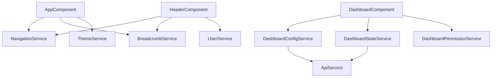

# 🏛️ SERVICE-ARCHITEKTUR - SOLID Principles Refactoring

## 🔴 Aktuelle Probleme

### NavigationService (236 Zeilen)
**Verletzt SRP - macht zu viel:**
- Route Navigation
- Breadcrumb Generation
- Navigation Items Management
- Badge Updates
- External Link Handling

### DashboardService (687 Zeilen!)
**Massive SRP-Verletzung:**
- Dashboard Configuration
- Widget Navigation
- Permission Checking
- Statistics Updates
- History Management

## ✅ Neue Architektur

### Single Responsibility Principle (SRP)

#### NavigationService aufteilen in:

```typescript
// 1. NavigationService (max. 50 Zeilen)
@Injectable({ providedIn: 'root' })
export class NavigationService {
  constructor(private router: Router) {}
  
  navigateTo(path: string, params?: any): Promise<boolean> {
    return this.router.navigate([path], { queryParams: params });
  }
  
  navigateExternal(url: string): void {
    window.open(url, '_blank');
  }
}

// 2. BreadcrumbService (max. 80 Zeilen)
@Injectable({ providedIn: 'root' })
export class BreadcrumbService {
  private breadcrumbs$ = new BehaviorSubject<Breadcrumb[]>([]);
  
  getBreadcrumbs(): Observable<Breadcrumb[]> {
    return this.breadcrumbs$.asObservable();
  }
  
  generateFromRoute(route: ActivatedRoute): void {
    // Breadcrumb-Logik
  }
}

// 3. NavigationItemService (max. 100 Zeilen)
@Injectable({ providedIn: 'root' })
export class NavigationItemService {
  private items$ = signal<NavigationItem[]>([]);
  
  getItems = computed(() => this.items$());
  
  updateBadge(itemId: string, count: number): void {
    // Badge-Update-Logik
  }
}
```

#### DashboardService aufteilen in:

```typescript
// 1. DashboardConfigService (max. 80 Zeilen)
@Injectable({ providedIn: 'root' })
export class DashboardConfigService {
  private config$ = signal<DashboardConfig>({});
  
  getConfig = computed(() => this.config$());
  
  loadConfig(dashboardType: string): Observable<DashboardConfig> {
    // Config-Lade-Logik
  }
}

// 2. WidgetNavigationService (max. 60 Zeilen)
@Injectable({ providedIn: 'root' })
export class WidgetNavigationService {
  navigateToWidget(widgetId: string): void {
    // Widget-Navigation
  }
}

// 3. DashboardStateService (max. 70 Zeilen)
@Injectable({ providedIn: 'root' })
export class DashboardStateService {
  private state$ = signal<DashboardState>({});
  
  updateStatistics(stats: Statistics): void {
    // State-Update
  }
}

// 4. DashboardPermissionService (max. 50 Zeilen)
@Injectable({ providedIn: 'root' })
export class DashboardPermissionService {
  canAccessWidget(widgetId: string): boolean {
    // Permission-Check
  }
}
```

## 🔧 Dependency Injection mit Interfaces

### Interface-Definition
```typescript
// interfaces/navigation.interface.ts
export interface INavigationService {
  navigateTo(path: string, params?: any): Promise<boolean>;
  navigateExternal(url: string): void;
}

export interface IBreadcrumbService {
  getBreadcrumbs(): Observable<Breadcrumb[]>;
  generateFromRoute(route: ActivatedRoute): void;
}

// Token-Definition
export const NAVIGATION_SERVICE = new InjectionToken<INavigationService>('NavigationService');
export const BREADCRUMB_SERVICE = new InjectionToken<IBreadcrumbService>('BreadcrumbService');
```

### Provider-Konfiguration
```typescript
// app.config.ts
export const appConfig: ApplicationConfig = {
  providers: [
    { provide: NAVIGATION_SERVICE, useClass: NavigationService },
    { provide: BREADCRUMB_SERVICE, useClass: BreadcrumbService },
    // ...
  ]
};
```

### Verwendung in Komponenten
```typescript
@Component({...})
export class HeaderComponent {
  constructor(
    @Inject(NAVIGATION_SERVICE) private nav: INavigationService,
    @Inject(BREADCRUMB_SERVICE) private breadcrumb: IBreadcrumbService
  ) {}
}
```

## 📏 Service-Standards

### Maximale Zeilenzahl
- **Kleine Services**: max. 50 Zeilen
- **Mittlere Services**: max. 80 Zeilen
- **Große Services**: max. 100 Zeilen (mit Begründung)

### Verantwortlichkeiten
- **Eine Hauptaufgabe** pro Service
- **Klare Namensgebung** die Zweck beschreibt
- **Keine Business-Logik** in UI-Services

## 🏗️ Refactoring-Strategie

### Phase 1: Interface-Definition
```typescript
// 1. Interfaces für alle Services definieren
// 2. Injection Tokens erstellen
// 3. Tests gegen Interfaces schreiben
```

### Phase 2: Service-Aufteilung
```typescript
// 1. Neue Services erstellen
// 2. Logik aus alten Services extrahieren
// 3. Tests anpassen
```

### Phase 3: Migration
```typescript
// 1. Komponenten auf neue Services umstellen
// 2. Alte Services als @deprecated markieren
// 3. Nach Übergangsphase entfernen
```

## 🧪 Test-Patterns

### Service-Test mit Mock
```typescript
describe('NavigationService', () => {
  let service: INavigationService;
  let router: jasmine.SpyObj<Router>;
  
  beforeEach(() => {
    const routerSpy = jasmine.createSpyObj('Router', ['navigate']);
    
    TestBed.configureTestingModule({
      providers: [
        NavigationService,
        { provide: Router, useValue: routerSpy }
      ]
    });
    
    service = TestBed.inject(NavigationService);
    router = TestBed.inject(Router) as jasmine.SpyObj<Router>;
  });
  
  it('sollte zu Route navigieren', async () => {
    router.navigate.and.returnValue(Promise.resolve(true));
    
    const result = await service.navigateTo('/test');
    
    expect(router.navigate).toHaveBeenCalledWith(['/test'], { queryParams: undefined });
    expect(result).toBe(true);
  });
});
```

## 📊 Service-Dependency-Graph



## ⚡ Performance-Optimierungen

### Lazy Services
```typescript
@Injectable({ providedIn: 'root' })
export class HeavyService {
  private _data?: HeavyData;
  
  get data(): HeavyData {
    if (!this._data) {
      this._data = this.loadData();
    }
    return this._data;
  }
}
```

### Service-Worker für Caching
```typescript
@Injectable({ providedIn: 'root' })
export class CachedApiService {
  private cache = new Map<string, Observable<any>>();
  
  get<T>(url: string): Observable<T> {
    if (!this.cache.has(url)) {
      this.cache.set(url, 
        this.http.get<T>(url).pipe(
          shareReplay(1)
        )
      );
    }
    return this.cache.get(url)!;
  }
}
```

## 🔒 Enforcement-Regeln

### ESLint-Regel für Service-Größe
```javascript
module.exports = {
  rules: {
    'max-lines': ['error', {
      max: 100,
      skipBlankLines: true,
      skipComments: true
    }],
    'max-lines-per-function': ['error', {
      max: 20,
      skipBlankLines: true,
      skipComments: true
    }]
  }
};
```