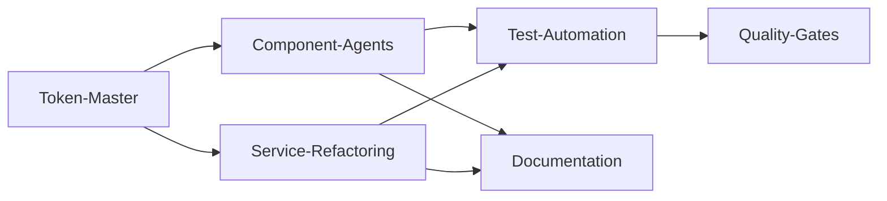

# 🚀 PARALLELISIERUNGS-PLAN - Multi-Agent Workflow

## 📊 Agent-Verteilung (10 Parallel-Agents)

### Agent 1: Token-Master
**Aufgaben:**
- Style Dictionary Setup
- Token-Migration von 4 Dateien → 1 Source
- Build-Pipeline einrichten
- Token-Dokumentation

**Zeitschätzung:** 3-4 Tage

### Agent 2-4: Component-Agents (Atoms)
**Agent 2 - Form Atoms:**
- Input, Select, Checkbox, Radio, Toggle
- Token-Integration
- Tests & Visual Tests

**Agent 3 - Display Atoms:**
- Button, Badge, Tag, Avatar, Icon
- Token-Integration  
- Tests & Visual Tests

**Agent 4 - Feedback Atoms:**
- Spinner, ProgressBar, Skeleton, Tooltip
- Token-Integration
- Tests & Visual Tests

**Zeitschätzung:** 4-5 Tage pro Agent

### Agent 5-6: Component-Agents (Molecules)
**Agent 5 - Form Molecules:**
- FormField, DatePicker, TimePicker, FileUpload
- Token-Integration
- Tests & Visual Tests

**Agent 6 - Layout Molecules:**
- Card, Modal, Tabs, Accordion, Dropdown
- Token-Integration
- Tests & Visual Tests

**Zeitschätzung:** 5-6 Tage pro Agent

### Agent 7: Service-Refactoring
**Aufgaben:**
- NavigationService → 3 Services
- DashboardService → 4 Services
- Interface-Definitionen
- Dependency Injection Setup

**Zeitschätzung:** 4-5 Tage

### Agent 8: Test-Automation
**Aufgaben:**
- Jest Test-Templates
- Puppeteer Visual Test Setup
- Coverage-Reports
- CI/CD Integration

**Zeitschätzung:** 3-4 Tage

### Agent 9: Quality-Gates
**Aufgaben:**
- ESLint-Regeln für Token-Usage
- Pre-Commit Hooks
- Automatische Code-Reviews
- Performance-Monitoring

**Zeitschätzung:** 2-3 Tage

### Agent 10: Documentation
**Aufgaben:**
- Entwickler-Handbuch
- Component-Storybook
- Migration-Guide
- Best Practices

**Zeitschätzung:** Fortlaufend

## 📋 Task-Dependencies



## 🎯 Parallel-Execution-Matrix

| Woche | Agent 1 | Agent 2-4 | Agent 5-6 | Agent 7 | Agent 8 | Agent 9 | Agent 10 |
|-------|---------|-----------|-----------|---------|---------|---------|----------|
| 1 | Token Setup | Warten | Warten | Interface Design | Test Setup | ESLint Rules | Struktur |
| 2 | Token Build | Atoms Start | Warten | Service Split | Visual Tests | Hooks | Guides |
| 3 | Fertig | Atoms Fertig | Molecules Start | Services Fertig | Integration | Monitoring | Updates |
| 4 | Support | Support | Molecules Fertig | Migration | Fertig | Fertig | Finalisierung |

## 🔄 Kommunikations-Protokoll

### Daily Sync (15 Min)
```markdown
## Agent Status Update

### Agent [Nummer]: [Name]
- **Gestern:** Was wurde fertiggestellt
- **Heute:** Was wird bearbeitet
- **Blocker:** Welche Hindernisse gibt es
- **Dependencies:** Auf welche anderen Agents warten
```

### Shared Resources
```
/shared/
├── tokens/              # Token-Master Output
├── interfaces/          # Service Interfaces
├── test-templates/      # Test-Agent Output
├── lint-rules/          # Quality-Agent Output
└── docs/               # Documentation-Agent Output
```

## 🚦 Koordinations-Punkte

### Checkpoint 1: Token-System Ready
- **Wann:** Ende Woche 1
- **Wer:** Token-Master
- **Output:** Funktionierende Token-Pipeline
- **Freigabe für:** Component-Agents

### Checkpoint 2: Atoms Complete
- **Wann:** Ende Woche 2
- **Wer:** Agent 2-4
- **Output:** Alle Atom-Komponenten migriert
- **Freigabe für:** Molecule-Agents

### Checkpoint 3: Services Refactored
- **Wann:** Ende Woche 3
- **Wer:** Agent 7
- **Output:** Neue Service-Architektur
- **Freigabe für:** Integration-Tests

## 📝 Agent-Spezifikationen

### Component-Agent Template
```typescript
// Agent-Aufgabe: [Component-Name] Migration

## Checklist:
- [ ] Token-Definition in tokens/semantic/[component].json
- [ ] Component nach 02-KOMPONENTEN-STANDARDS.md
- [ ] Unit-Tests (min. 80% Coverage)
- [ ] Visual-Tests mit Puppeteer
- [ ] Showcase-Page erstellt
- [ ] Props-Dokumentation

## Input:
- Token-System von Agent 1
- Test-Templates von Agent 8

## Output:
- Migrierte Komponente
- Tests
- Dokumentation
```

### Service-Agent Template
```typescript
// Agent-Aufgabe: [Service-Name] Refactoring

## Checklist:
- [ ] Interface definiert
- [ ] Service aufgeteilt (max. 100 Zeilen)
- [ ] Injection Token erstellt
- [ ] Tests angepasst
- [ ] Migration-Guide geschrieben

## Input:
- Service-Architektur-Guide

## Output:
- Neue Services
- Interfaces
- Tests
```

## 🎨 Automatisierte Workflows

### GitHub Actions für Agents
```yaml
name: Agent Workflow
on:
  pull_request:
    paths:
      - 'src/app/shared/components/**'
      
jobs:
  validate-tokens:
    runs-on: ubuntu-latest
    steps:
      - name: Check Token Usage
        run: npm run lint:tokens
        
  visual-tests:
    runs-on: ubuntu-latest
    steps:
      - name: Run Puppeteer Tests
        run: npm run test:visual
        
  coverage:
    runs-on: ubuntu-latest
    steps:
      - name: Check Coverage
        run: npm run test:coverage -- --min=80
```

## 🏁 Erfolgs-Kriterien

### Pro Agent
- ✅ Alle zugewiesenen Tasks abgeschlossen
- ✅ Code-Review bestanden
- ✅ Tests grün
- ✅ Dokumentation vollständig

### Gesamt-Projekt
- ✅ 0 hardcodierte Werte
- ✅ Alle Services < 100 Zeilen
- ✅ 100% Token-Coverage
- ✅ Visual Tests für alle Komponenten
- ✅ Entwickler-Handbuch komplett