# 🤖 KI-SELBSTTEST-SYSTEM - Automatische Code-Validierung

## Übersicht

Dieses System stellt sicher, dass JEDE KI (Claude, GitHub Copilot, etc.) ihren generierten Code automatisch gegen alle Qualitätsregeln testet und korrigiert.

## 🔄 KI-Entwicklungs-Workflow

```mermaid
graph TD
    A[KI startet Task] --> B[Token-Definitionen prüfen]
    B --> C{Tokens vorhanden?}
    C -->|Nein| D[Tokens erstellen]
    C -->|Ja| E[Code schreiben]
    D --> E
    E --> F[Selbst-Validierung]
    F --> G{Alle Tests grün?}
    G -->|Nein| H[Fehler analysieren]
    G -->|Ja| I[Code committen]
    H --> J[Auto-Fix anwenden]
    J --> F
```



## 📋 KI-Pflicht-Checkliste

### VOR dem Code-Schreiben:
```typescript
// KI MUSS diese Checks ausführen:
const preCodeChecks = async () => {
  // 1. Token-Verfügbarkeit prüfen
  const tokensExist = await checkTokensExist(componentName);
  if (!tokensExist) {
    await createTokenDefinition(componentName);
  }
  
  // 2. Dependencies prüfen
  const depsInstalled = await checkDependencies();
  if (!depsInstalled) {
    await exec('npm install');
  }
  
  // 3. Test-Setup prüfen
  const testEnvReady = await checkTestEnvironment();
  return tokensExist && depsInstalled && testEnvReady;
};
```

### WÄHREND des Code-Schreibens:
```typescript
// KI führt Live-Checks aus:
const liveValidation = {
  onColorUsage: (color: string) => {
    if (color.startsWith('#') || color.match(/rgb/)) {
      throw new Error(`❌ Hardcoded color: ${color}`);
    }
  },
  
  onClassUsage: (className: string) => {
    const forbidden = ['bg-orange-500', 'text-blue-700', 'p-4'];
    if (forbidden.some(f => className.includes(f))) {
      throw new Error(`❌ Forbidden class: ${className}`);
    }
  },
  
  onServiceSize: (lines: number) => {
    if (lines > 100) {
      throw new Error(`❌ Service too large: ${lines} lines`);
    }
  }
};
```

### NACH dem Code-Schreiben:
```bash
# KI MUSS diese Befehle ausführen:
npm run ki:validate

# Dieser Befehl führt aus:
# 1. Token Compliance Check
# 2. Unit Tests
# 3. Visual Tests
# 4. Coverage Check
# 5. Performance Check
```

## 🛠️ KI-Tooling

### 1. Token-Validator für KI
```typescript
// tools/ki-token-validator.ts
export class KiTokenValidator {
  validateComponent(componentCode: string): ValidationResult {
    const violations = [];
    
    // Check für Hex-Farben
    const hexColors = componentCode.match(/#[0-9A-Fa-f]{6}/g);
    if (hexColors) {
      violations.push({
        type: 'HARDCODED_COLOR',
        found: hexColors,
        fix: hexColors.map(c => this.getTokenForColor(c))
      });
    }
    
    // Check für Tailwind-Klassen
    const tailwindColors = componentCode.match(/bg-(red|blue|orange)-\d{3}/g);
    if (tailwindColors) {
      violations.push({
        type: 'TAILWIND_COLOR',
        found: tailwindColors,
        fix: tailwindColors.map(c => this.getTokenForTailwind(c))
      });
    }
    
    return {
      valid: violations.length === 0,
      violations,
      autoFix: () => this.applyFixes(componentCode, violations)
    };
  }
}
```

### 2. Auto-Fix System für KI
```typescript
// tools/ki-auto-fix.ts
export class KiAutoFix {
  private fixMappings = {
    // Farben
    '#F99600': "tokenUtils.getColor('primary.500')",
    '#1C3661': "tokenUtils.getColor('secondary.500')",
    
    // Tailwind
    'bg-orange-500': "tokenUtils.getColorClass('bg', 'primary.500')",
    'text-white': "tokenUtils.getColorClass('text', 'white')",
    
    // Größen
    'p-4': "tokenUtils.getSpacingClass('p', 'md')",
    'text-sm': "tokenUtils.getTextSizeClass('sm')"
  };
  
  fix(code: string): string {
    let fixedCode = code;
    
    Object.entries(this.fixMappings).forEach(([search, replace]) => {
      fixedCode = fixedCode.replace(new RegExp(search, 'g'), replace);
    });
    
    return fixedCode;
  }
}
```

### 3. KI Test-Runner
```typescript
// tools/ki-test-runner.ts
export class KiTestRunner {
  async runAllTests(componentName: string): Promise<TestResults> {
    const results = {
      tokenCompliance: await this.runTokenTests(componentName),
      unitTests: await this.runUnitTests(componentName),
      visualTests: await this.runVisualTests(componentName),
      coverage: await this.runCoverageCheck(componentName),
      performance: await this.runPerformanceTests(componentName)
    };
    
    // Automatische Korrektur bei Fehlern
    if (!results.tokenCompliance.passed) {
      await this.autoFixTokens(componentName);
      // Erneut testen
      results.tokenCompliance = await this.runTokenTests(componentName);
    }
    
    return results;
  }
}
```

## 📊 KI-Performance-Metriken

### KI muss diese Metriken erreichen:
```typescript
const KI_QUALITY_THRESHOLDS = {
  tokenCompliance: 100,  // 100% Token-Nutzung
  testCoverage: 85,      // Minimum 85% Coverage
  codeSmells: 0,         // Keine Code Smells
  duplicateCode: 0,      // Kein duplizierter Code
  complexityScore: 10,   // Max Cyclomatic Complexity
  performanceScore: 90   // Performance Score
};
```

## 🚨 KI-Fehlerbehandlung

### Automatische Fehlerkorrektur:
```typescript
class KiErrorHandler {
  async handleValidationError(error: ValidationError): Promise<void> {
    switch (error.type) {
      case 'HARDCODED_COLOR':
        await this.fixHardcodedColors(error);
        break;
        
      case 'MISSING_TESTS':
        await this.generateMissingTests(error);
        break;
        
      case 'SERVICE_TOO_LARGE':
        await this.splitService(error);
        break;
        
      case 'LOW_COVERAGE':
        await this.addMoreTests(error);
        break;
    }
  }
}
```

## 🎯 KI-Workflow-Beispiel

### Komplette Component-Erstellung durch KI:
```bash
# 1. KI startet Task
ki start --component button

# 2. KI prüft Tokens
✓ Checking token definitions...
✗ Missing tokens for button component
→ Creating tokens/semantic/button.json

# 3. KI schreibt Component
✓ Writing ButtonComponent...
✓ Applying token utilities...
✓ Adding accessibility features...

# 4. KI validiert Code
✓ Running token compliance check...
✗ Found 2 hardcoded colors
→ Applying auto-fix...
✓ Re-running validation...
✓ All checks passed!

# 5. KI schreibt Tests
✓ Generating unit tests...
✓ Generating visual tests...
✓ Coverage: 92%

# 6. KI committed
✓ All quality gates passed
✓ Code committed successfully
```

## 🔒 KI-Sicherheitsmechanismen

### Verhindert schlechten Code:
```typescript
// KI kann NICHT committen wenn:
const blockCommitIf = {
  tokenViolations: count => count > 0,
  testCoverage: coverage => coverage < 80,
  serviceSize: lines => lines > 100,
  visualRegression: hasRegression => hasRegression,
  performanceRegression: hasRegression => hasRegression
};
```

### Automatische Rollbacks:
```typescript
// Bei kritischen Fehlern
if (criticalErrorDetected) {
  await git.reset('--hard HEAD~1');
  await ki.retryWithDifferentApproach();
}
```

## 📈 KI-Lernprozess

### KI speichert erfolgreiche Patterns:
```typescript
// ki-patterns.json
{
  "successfulPatterns": {
    "buttonComponent": {
      "tokenUsage": "tokenUtils.getComponentClasses('button', variant, size)",
      "testStrategy": "test all variants and sizes",
      "commonFixes": ["replace hardcoded colors", "add aria-labels"]
    }
  },
  "avoidPatterns": {
    "commonMistakes": ["inline styles", "missing OnPush", "no token usage"]
  }
}
```

## 🏆 KI-Qualitäts-Score

### Jede KI-Session wird bewertet:
```typescript
const calculateKiScore = (session: KiSession) => {
  return {
    efficiency: session.fixAttempts === 0 ? 100 : 100 / session.fixAttempts,
    quality: (session.testsWritten / session.codeLines) * 100,
    compliance: session.tokenViolations === 0 ? 100 : 0,
    overall: (efficiency + quality + compliance) / 3
  };
};
```

**Ziel: KI-Score > 95% für jede Session!**